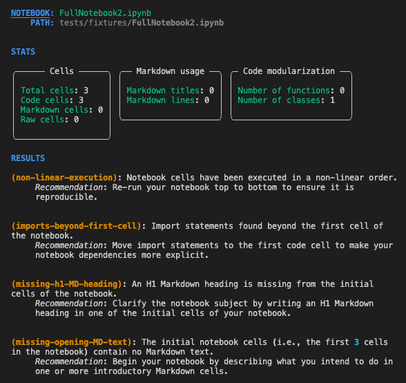
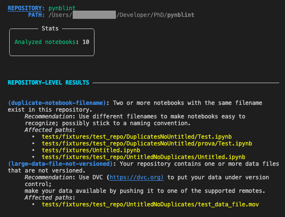

.. Pynblint documentation master file, created by
   sphinx-quickstart on Tue Feb  1 12:01:56 2022.
   You can adapt this file completely to your liking, but it should at least
   contain the root `toctree` directive.

Pynblint
========

Welcome to the Pynblint documentation!

Pynblint is a linter for Jupyter notebooks written in Python. It
performs a set of checks on notebooks and surrounding repositories based
on empirically validated best practices; upon identifying potential defects,
Pynblint also provides recommendations on how to improve analyzed notebooks.

Getting up and running with Pynblint is easy! Go through the following
steps to install and get started with the tool. You’ll be ready in no
time to assure the quality of your notebooks!

Installation
------------

You can install Pynblint from PyPI with ``pip`` or using your favorite
package manager:

.. code:: shell

   pip install pynblint

To update a previous installation of Pynblint to the latest version, add
the ``-U`` option to the command above.

If you are managing your dependencies with Poetry, you can install
Pynblint as a development dependency.

.. code:: shell

   poetry add --dev pynblint

Quick Start
-----------

Analyzing a standalone notebook with Pynblint is as easy as running:

.. code:: shell

   pynblint path/to/your/notebook/FullNotebook2.ipynb

By default, linting results are printed to the standard output.

First, Pynblint will report a bunch of notebook statistics (e.g., the
number of notebook cells grouped by type). If you are not interested in
these statistics, you can use the option ``--hide-stats`` (``-S`` for
short) to hide the related section from the output.

Then, Pynblint will report linting results (hereinafter also referred to
as *lints* or *violations*). Each linting result is uniquely identified
by its own **slug** (e.g., in the image above, ``non-linear-execution``
is the slug of the first detected violation). Slugs are followed by a
brief **description** of the related issue and (optionally) by a
**recommendation** on how to solve it. If you don’t need Pynblint to
print recommendations, you can hide them by adding the
``--hide-recommendations`` option (``-R`` for short) to the ``pynblint``
command.

👀 As the output of pynblint can get quite lengthy, piping it into a
pager like ``less`` is recommended. E.g.:

.. code:: shell

   pynblint path/to/your/notebook/FullNotebook2.ipynb | less

Analyzing repositories
~~~~~~~~~~~~~~~~~~~~~~

Typically, notebooks are written within project repositories, e.g.,
local folders containing utility scripts, data, and other useful
resources besides the notebooks themselves. With Pynblint, you are
encouraged to analyze your notebooks in the context of the project
repository they live in. By doing so, you will enable additional checks
which take the notebook surroundings into account; moreover, you will
get linting results for all the notebooks in your current project at
once.

Simply feed Pynblint with the path to the root folder of your project:

.. code:: shell

   pynblint path/to/your/project/folder/

The terminal output will start with a section dedicated to
repository-level statistics and linting results. After that, Pynblint
will print violations pertaining to each notebook found in the project
repository. Pynblint discovers notebooks by recursively traversing the
file-system tree, starting from the specified input path.

Ignoring specific violations
~~~~~~~~~~~~~~~~~~~~~~~~~~~~

If you want Pynblint to ignore a certain set of linting rules, you can
specify the related slugs as arguments to the ``--exclude`` option
(``-e`` for short). The list of violations to be ignored should be
specified as a JSON-encoded list of slugs.

For instance, the following command:

.. code:: shell

   pynblint Notebook.ipynb --exclude '["notebook-too-long", "non-portable-chars-in-nb-name"]'

will ignore the violations ``notebook-too-long`` and
``non-portable-chars-in-nb-name`` during the linting process.

*Also the opposite is possible*: you can ask Pynblint to only consider a
certain subset of violations and ignore the rest. This is done with the
``--include`` option (abbreviated ``-i``), which takes a list of slugs
in the same format as the ``--exclude`` option.

Project-level Pynblint configuration file
~~~~~~~~~~~~~~~~~~~~~~~~~~~~~~~~~~~~~~~~~

Pynblint has a quite extensive array of options. You can easily explore
them by running:

.. code:: shell

   pynblint --help

If you find yourself using some options over and over again (e.g., to
exclude certain linting checks you don’t need for your project), you
might want to add them to a Pynblint configuration file.

Pynblint supports configuration files in the dotenv format. To configure
Pynblint for a specific project, place a dotenv file named ``.pynblint``
in the root directory of your project. In general, Pynblint expects to
find a ``.pynblint`` configuration file in the folder from which it is
invoked.

A dotenv file follows the same general principles of all environment
variables. It looks something like this:

.. code:: shell

   # Pynblint configuration file

   MAX_CELLS_IN_NOTEBOOK=80
   MAX_LINES_IN_CODE_CELL=40
   INITIAL_CELLS=5
   EXCLUDE="notebook-too-long,non-portable-chars-in-nb-name"

Settings specified via the command line interface take precedence over
the settings written in a project-level configuration file.

Export linting results
~~~~~~~~~~~~~~~~~~~~~~

Pynblint results can be saved in the JSON format. Further export formats
will be available soon (Markdown and HTML are currently on our roadmap).

The ``--output`` option (``-o`` for short) lets you specify the name of
the output file. Be careful to use the ``.json`` extension, as it is the
only one supported to date.

While exporting, you can suppress Pynblint’s terminal output by adding
the ``--quiet`` (``-q``) option.

In the following example, we run Pynblint quietly and export linting
results to a JSON file named ``./report.json``.

.. code:: shell

   pynblint Using\ pynblint.ipynb -qo report.json

..
   .. toctree::
      :maxdepth: 2
      :caption: User Guide

.. toctree::
   :maxdepth: 1
   :caption: API Reference

   API_reference/repository
   API_reference/notebook
